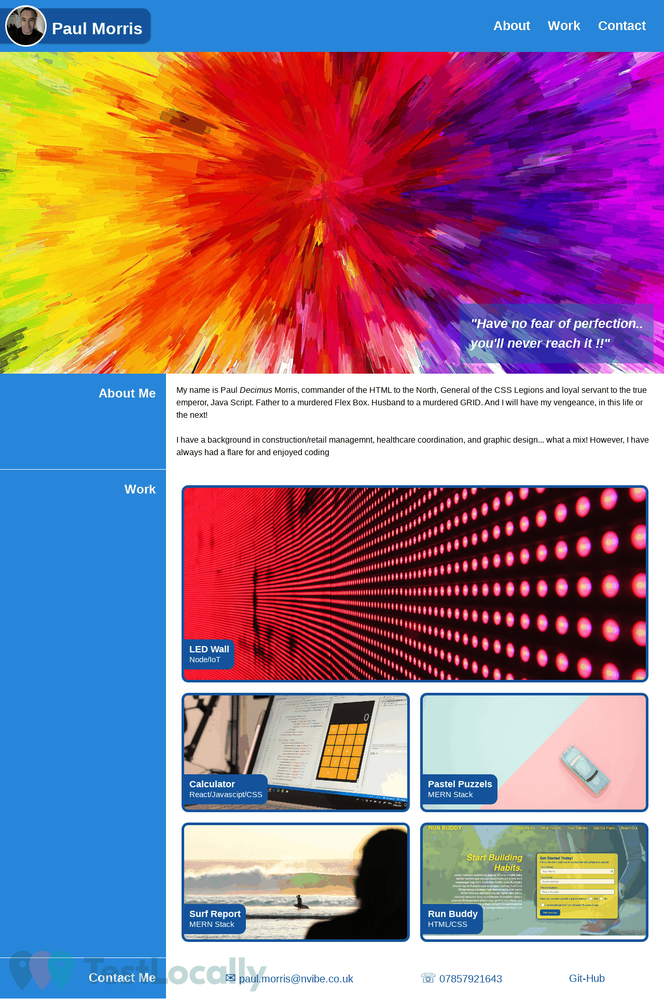

# Portfolio

## Description

This is my first attempt at a portfolio website as part of my skills for life course.
I was tasked with presenting a recent photo, links to sections about me, my work (albeit they are place holder examples from the course and not my actual work items... yet!) and how to contact me.
it was also important that links scrolls the UI to the corresponding section and the first application in the work section was larger that the others by utilising grids. The is also responsive and adapts the the viewport via media querys.

## Table of Contents 

- [Usage](#usage)
- [Credits](#credits)
- [License](#license)

## Usage

The following image shows the web application's appearance and functionality:

> **Note**: This layout is responsive and will display correctly on PC as well as mobile

## Credits

Skills for Life Boot Camp

## License

MIT License

Copyright (c) 2022 creative2012

Permission is hereby granted, free of charge, to any person obtaining a copy
of this software and associated documentation files (the "Software"), to deal
in the Software without restriction, including without limitation the rights
to use, copy, modify, merge, publish, distribute, sublicense, and/or sell
copies of the Software, and to permit persons to whom the Software is
furnished to do so, subject to the following conditions:

The above copyright notice and this permission notice shall be included in all
copies or substantial portions of the Software.

THE SOFTWARE IS PROVIDED "AS IS", WITHOUT WARRANTY OF ANY KIND, EXPRESS OR
IMPLIED, INCLUDING BUT NOT LIMITED TO THE WARRANTIES OF MERCHANTABILITY,
FITNESS FOR A PARTICULAR PURPOSE AND NONINFRINGEMENT. IN NO EVENT SHALL THE
AUTHORS OR COPYRIGHT HOLDERS BE LIABLE FOR ANY CLAIM, DAMAGES OR OTHER
LIABILITY, WHETHER IN AN ACTION OF CONTRACT, TORT OR OTHERWISE, ARISING FROM,
OUT OF OR IN CONNECTION WITH THE SOFTWARE OR THE USE OR OTHER DEALINGS IN THE
SOFTWARE.